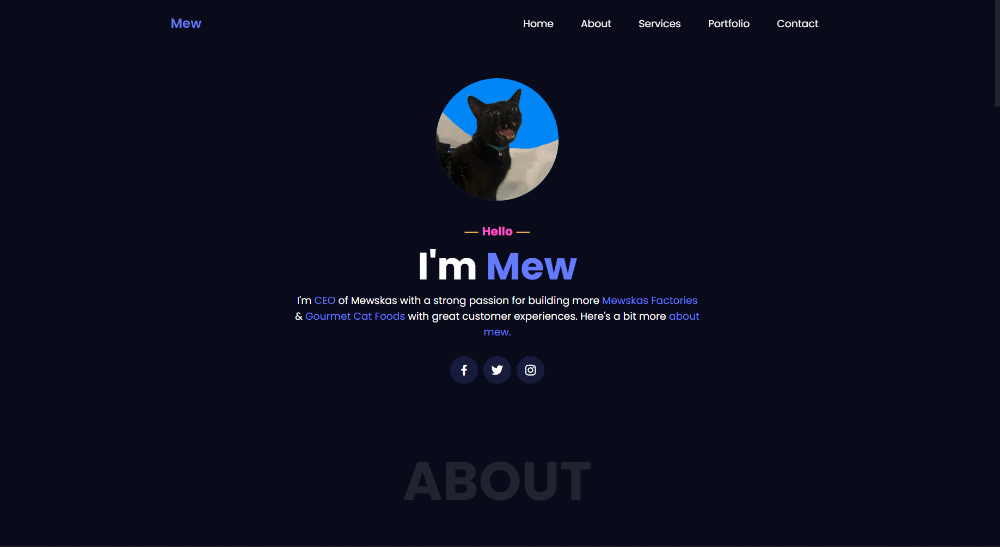
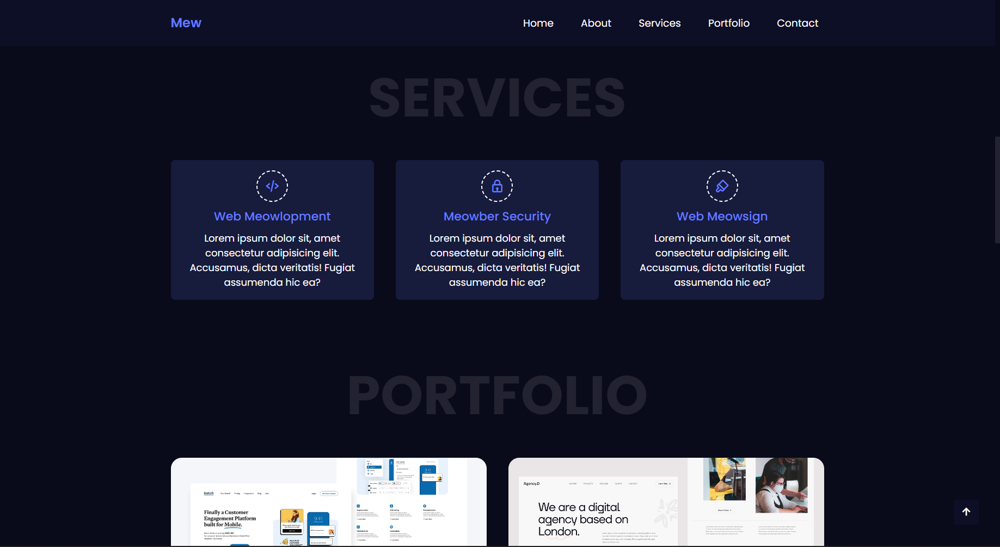
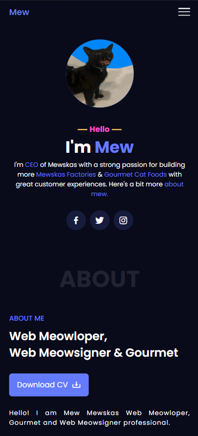
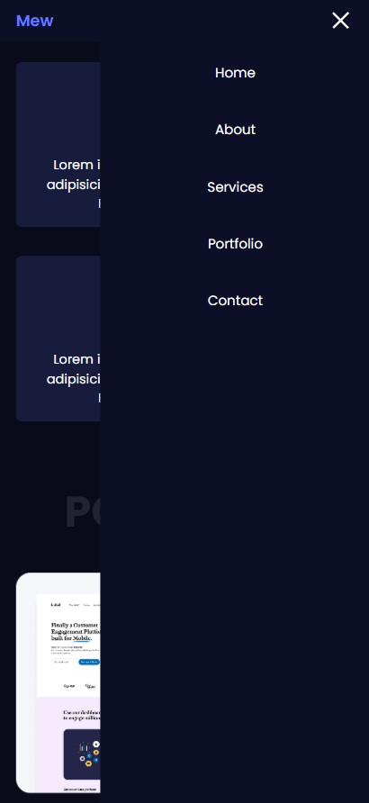

# Mew - Portfolio Website

Mew is a fully responsive and functional portfolio website that contains various animations. Contact form redirects actual messages via email. The code is written purely with HTML, CSS, and JavaScript. The code also contains:

- CDN's
- Web API's

Go to website: https://seliun.github.io/Portfolio-Website/

## ✨ How It Looks:

### Desktop ⬇️

### Mobile ⬇️

